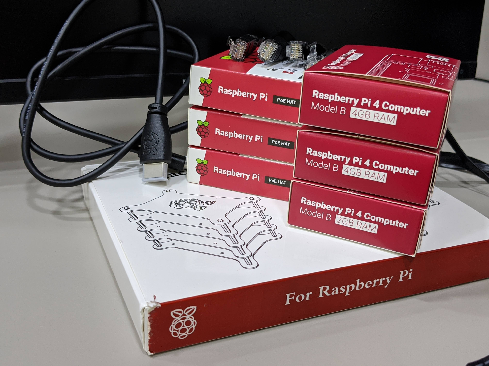
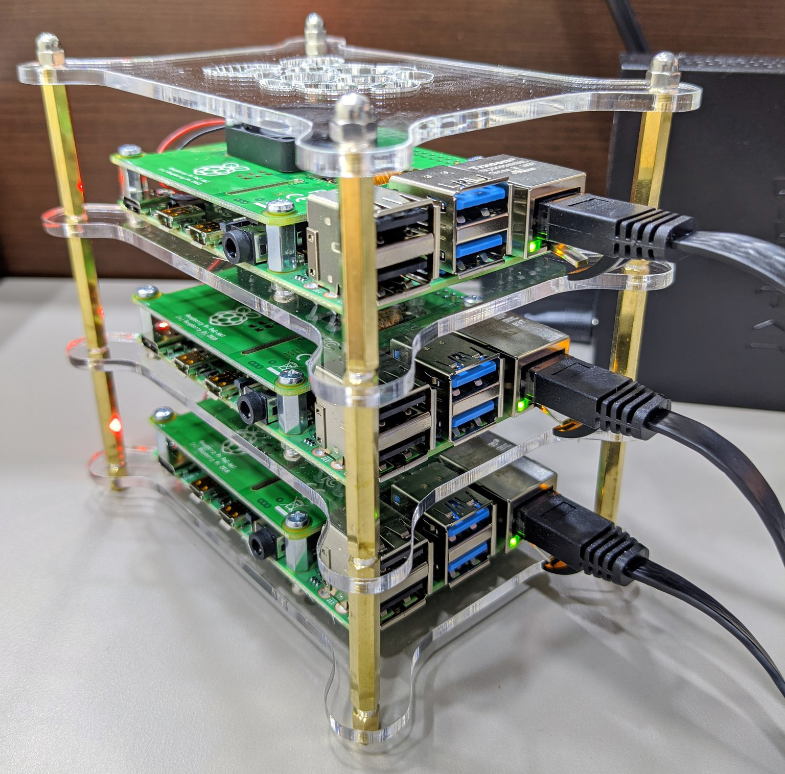
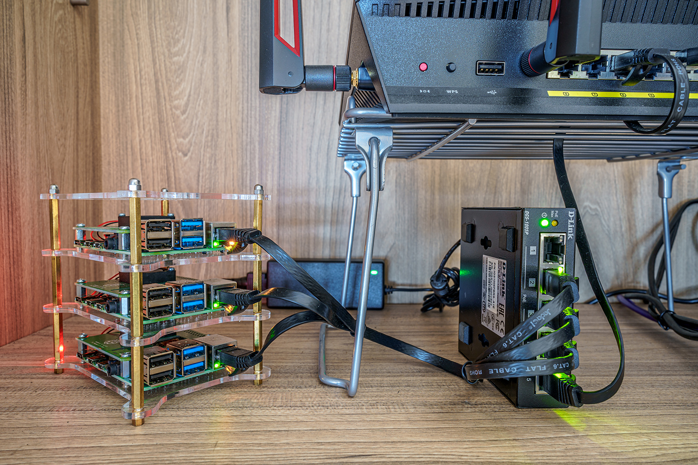

One of my experiments from late last year involved buying a bunch of Raspberry Pi's and
seeing how difficult it would be for me to set up a Kubernetes cluster. The goal would be
having a hosting platform for all sorts of cool microservices (that i have yet to build,
still). This wasn't as straightforward as I had hoped, so I'm documenting this down for
anyone brave enough to attempt it.

## The parts
There are many ways to build your cluster and I chose to use the "cleanest" method to
reduce the number of dangling cables in my ~~datacenter~~ closet rack. This ended up
costing more so exercise your own discretion. These are the parts I used:

| Quantity | Part                       | Cost (SGD) |
|:--------:|----------------------------|-----------:|
|2| [Raspberry Pi 4 (4GB)](https://sg.rs-online.com/web/p/processor-microcontroller-development-kits/1888310/) | 163.54 |
|1| [Raspberry Pi 4 (2GB)](https://sg.rs-online.com/web/p/processor-microcontroller-development-kits/1822095/) | 65.4 |
|3| [Raspberry Pi PoE HATs](https://sg.rs-online.com/web/p/power-management-development-kits/1735595/) | 87.18 |
|3| [microSD Card (32GB)](https://www.lazada.sg/products/sandisk-ultra-microsd-16gb-i-32gb-i-64gb-i-128gb-80mbs-micro-sd-uhs-1-tf-memory-card-i282711399-s452180103.html) | 26.7 |
|4| [Short Ethernet Cables](https://www.amazon.com/gp/product/B01IQWGKQ6/)| 9.73 |
|1| [Small PoE Switch](https://www.hachi.tech/biz-solutions/networking-wireless/network-switches/d-link-dgs-1005p-5-port-gigabit-metal-desktop-switch--0790069440984) | 49.00 |
|1| [Micro-USB to HDMI cable](https://sg.rs-online.com/web/p/hdmi-cables/1871377/) | 7.27 |
|1| [Acrylic Stack Case](https://www.amazon.com/gp/product/B07BGYGLZG/)| 22.71 |
| | **Total** | 431.53 |

PoE (Power over Ethernet) helps to reduce one cable on each Pi as the same ethernet cable
can supply both power and network. Raspberry Pi models 3+ have ethernet ports that are
PoE-aware but you need a HAT (Hardware Attached on Top) on each Pi to regulate power. You
also remove the need for 3 power points but will require a PoE switch instead.

As to why I got a single 2GB Pi and not 3 x 4GB ones, the idea was that the 2GB one would
be the master node while the 4GB ones would be the worker nodes. In reality, there are
numerous administrative workloads that you might want to run on the master node, so I
would have gotten 3 x 4GB ones on hindsight.

The Micro-USB to HDMI cable is only used for initial setup and potential debugging, but
it's in the list since it's not a very common cable to have lying around. I also reused
2 spare microSD cards I already had and only bought 1, but I priced them above to make the
total cost realistic.

You'll also need a standard USB keyboard, which I will assume most people have and a
microSD card reader for your computer. Add that to the list if you don't have one.



## Assembly
1. Screw in the 4 standoffs onto each Pi
2. Attach the PoE HATs on the standoffs and screw in
3. Screw in the Pi's onto the stack case layers
4. Stack the layers by screwing on the pillar standoffs
5. Connect each Pi to the PoE switch with an ethernet cable
6. Connect the PoE switch to your internet source with an ethernet cable
7. Plug in the power for the PoE switch
8. Power on the switch to ensure everything lights up and the fans are spinning
9. Power down the switch



## Preparing the OS
There are a couple of choices for what OS to install. I initially went with Ubuntu, only
to find their compatibility lacking and went back to the default Raspbian OS. This might
have changed now but I'm happy enough with Raspbian to stick to it. Another reason to
stick to Raspbian is that you need this OS to perform firmware upgrades on the Pi's. If
you use another OS primarily, you will need to keep a spare microSD card with Raspbian
installed and swap out cards for firmware upgrades.

1. Download the [Raspbian Buster Lite](https://www.raspberrypi.org/downloads/raspbian) image
2. Download a flashing utility like [Balena Etcher](https://www.balena.io/etcher)
3. For each microSD card:
   - Insert into your card reader/computer
   - Flash the image onto the card.
   - Remove the card and insert into a Pi
4. Power on the PoE switch

## Decide on networking
For each node, you will need to choose a hostname and a static IP.

| Role   | Hostname | IP        |
| ------ | -------- | --------- |
| Master | knode1   | 10.0.0.71 |
| Worker | knode2   | 10.0.0.72 |
| Worker | knode3   | 10.0.0.73 |

You should also note down your router's IP and which DNS servers you wish to use. In this
example, my router is also serving as the first DNS server aside from CloudFlare and
Google's DNS servers.
```
Router IP = 10.0.0.1
DNS Servers = 10.0.0.1 1.1.1.1 8.8.8.8
```

## Configure Raspbian
For each Pi:
1. Connect the Micro-USB to HDMI cable between a Pi and a monitor
2. Connect a USB keyboard to the same Pi
3. Login to Raspbian as the user `pi` with password `raspberry`
4. Update the kernel using `sudo rpi-update` then `sudo reboot`
5. Enable the 64-bit kernel by adding this line at the end
   - `sudo vi /boot/config.txt`
   ```
   arm_64bit=1
   ```
6. Disable IPv6 and enable cgroups by inserting this string before everything else
   - `sudo vi /boot/cmdline.txt`
    ```
    ipv6.disable=1 cgroup_enable=cpuset cgroup_enable=memory cgroup_memory=1
    ```
7. Setup static networking by uncommenting and editing the `eth0` block
   - `sudo vi /etc/dhcpcd.conf`
    ```
    interface eth0
    static ip_address=10.0.0.71/24
    static routers=10.0.0.1
    static domain_name_servers=10.0.0.1 1.1.1.1 8.8.8.8
    ```
8. Disable swap
```bash
sudo dphys-swapfile swapoff
sudo dphys-swapfile uninstall
sudo systemctl disable dphys-swapfile
```
9. Launch `sudo raspi-config` and set the following
   - `Change User Password`
   - `Network Options` > `Hostname`
   - `Localisation Options` > `Timezone`
   - `Interfacing Options` > `SSH`
10. Finish. Agree to reboot.

## Install Docker + Kubernetes
Now that we've enabled SSH, we can leave the Pi's alone on the rack and move to our
comfortable workstation. For each Pi, SSH into them and perform these steps.
1. Update software repositories:
   - `sudo apt update && sudo apt upgrade -y && sudo apt autoremove -y`
2. Install Docker
```bash
sudo curl -sL get.docker.com |  sh
sudo usermod -aG docker pi
sudo sysctl net.bridge.bridge-nf-call-iptables=1
sudo reboot
```
3. Prepare for Kubernetes
```bash
sudo apt-get install -y kubeadm
sudo update-alternatives --set iptables /usr/sbin/iptables-legacy
sudo update-alternatives --set ip6tables /usr/sbin/ip6tables-legacy
sudo update-alternatives --set ebtables /usr/sbin/ebtables-legacy
```

## Create the cluster
1. SSH into the master node
2. Grab the latest Kubernetes images
   - `kubeadm config images pull`
3. Initialise the cluster
   - `sudo kubeadm init`
   - Note down the command + key at the end and copy it
4. Setup the `kubectl` config
```bash
mkdir -p $HOME/.kube
sudo cp -i /etc/kubernetes/admin.conf $HOME/.kube/config
sudo chown $(id -u):$(id -g) $HOME/.kube/config
```
5. Setup cluster overlay network
   - There are a couple to choose from and I'm using weave
   ```bash
   kubectl apply -f "https://cloud.weave.works/k8s/net?k8s-version=$(kubectl version | base64 | tr -d '\n')&env.NO_MASQ_LOCAL=1"
   ```
6. SSH into the worker nodes and run the command from Step 3
7. Back at master node, use `kubectl get nodes` to check the join status
8. Once you see all nodes as ready, your cluster is ready.
```
NAME     STATUS   ROLES    AGE  VERSION
knode1   Ready    master   0d   v1.16.3
knode2   Ready    worker   0d   v1.16.3
knode3   Ready    worker   0d   v1.16.3
```

## Test the cluster
1. Let's do a test deployment of `nginx`
```bash
kubectl apply -f https://k8s.io/examples/application/deployment.yaml
```
2. Inspect the deployment: `kubectl describe deployment nginx-deployment`
3. List the running pods: `kubectl get pods`
4. Inspect one of the pods: `kubectl describe pod <pod-name>`
5. Delete the deployment: `kubectl delete deployment nginx-deployment`

## Let there be light
Your cluster is now alive, albeit in a very basic form. There will be more posts in this
series to elaborate on things you can add to your cluster to achieve a more *cloud* feel.


