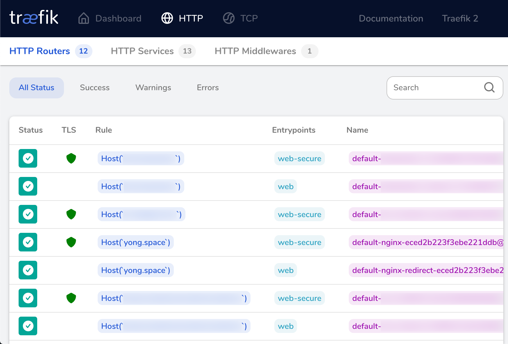
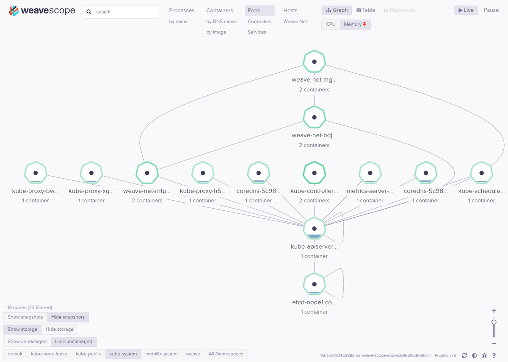

In the [previous post](/raspberry-pi-k8s), I described how to build a Kubernetes cluster
of Raspberry Pi 4s from scratch. While you get an operational cluster that is fully
capable of deploying basic workloads, it is vastly different to a managed cluster provided
by a cloud vendor, simply because *there is no cloud*. Instead, you will have to find bare
metal alternatives that hook into the same infrastructure.

## Package Manager
This concept isn't specific to a Raspberry Pi cluster, but [Helm](https://helm.sh) is a
nice utility to have for "app store"-like deployments that you can browse on [Helm
Hub](https://hub.helm.sh). They've changed out the architecture in v3, removing the need
for a dedicated *Tiller* pod that manages helm deployments, so all you now need is the
`helm` CLI. After installing the CLI, you'll need to add repositories and update their
contents before you can install charts from them. For example, if you wanted to install
the `nginx` chart from `stable`:

```bash
helm repo add stable https://kubernetes-charts.storage.googleapis.com/
helm repo update
helm install nginx stable/nginx
```

*Caveat: At least that's how it's supposed to work in theory. In reality, most of the
charts you'll find on Helm Hub are based on x86_64 images and do not support ARM out of
the box. You will most likely need to source for an image repo that supports multi-arch
including ARM and use the `--set image.repository` flag to override the image to pull.*

## Storage
Containers are meant to be transient with [Persistent
Volumes](https://kubernetes.io/docs/concepts/storage/persistent-volumes) in Kubernetes
being the solution for.. well, persistent storage. A cloud provider will easily provision
storage from nowhere and bill you, but at home you'll need to decide on storage medium. I
personally already had a NAS so that decision was a no-brainer. Using a NAS for this
requires creating a NFS share and the process will differ depending on your NAS vendor. I
use Synology so I followed [these instructions for their DSM
panel](https://synology.com/en-us/knowledgebase/DSM/tutorial/File_Sharing/How_to_access_files_on_Synology_NAS_within_the_local_network_NFS).

After creating the NFS share, install the `nfs-client-provisioner` helm chart as follows.
Replace the `NAS_IP` and `/path/to/nfs/share` as appropriate. We'll need to override the
repository here as the default one does not have an ARM binary.

```bash
helm install nfs-client-provisioner stable/nfs-client-provisioner \
  --set nfs.server=NAS_IP \
  --set nfs.path=/path/to/nfs/share \
  --set image.repository=quay.io/external_storage/nfs-client-provisioner-arm
```

The helm chart installs a storage class named `nfs-client`, which we'll patch with a
`is-default-class` annotation so that all future persistent volume claims will
automatically use it.

```bash
kubectl patch storageclass nfs-client -p \
  '{"metadata":{"annotations":{"storageclass.kubernetes.io/is-default-class":"true"}}}'
```

To test this, we'll create a simple persistent volume claim in `test-pvc.yaml`.
```yaml
apiVersion: v1
kind: PersistentVolumeClaim
metadata:
  name: test-pvc
spec:
  accessModes:
  - ReadWriteOnce
  resources:
    requests:
      storage: 1Gi
```

Then apply it and check its status.
```bash
$ kubectl apply -f test-pvc.yaml
persistentvolumeclaim/test-pvc created

$ kubectl get pvc
NAME      STATUS  VOLUME    CAPACITY  ACCESS MODES  STORAGECLASS  AGE
test-pvc  Bound   pvc-a9..  1Gi       RWO           nfs-client    6s
```

If you check the directory of the NFS share in your NAS, a new sub-directory named
`default-test-pvc-pvc-a9..` will appear. You can now mount that claim in your deployment
and manage its contents from your NAS.

## Load Balancers
When exposing a service on a deployment, there are a few types to choose from. `ClusterIP`
is for internal services while `NodePort` and `LoadBalancer` are for external-facing
services. Using `NodePort` forces you to specify the address of a specific node and use a
rather large port number (30000-32767) to access your service. Using `LoadBalancer`
typically assigns a random IP and routes traffic on the source port between the available
nodes.

Since we don't have a cloud vendor to assign real external IPs, exposing services
externally (to the Internet, not just the cluster) will first require an internal load
balancer followed by some manual work on your router's port forwarding configuration. This
is only if you want to expose your services this way, which I do not recommend in favour
of an [ingress controller](pi-k8s-services#ingress-controller).

You can create dynamic internal load balancers using [Metal LB](
https://metallb.universe.tf). While the project disclaims itself as still being in *beta*,
it has worked quite well for me. Obviously, there is a distinction between what personal
and enterprise production means so weigh your own risks. Install Metal LB as follows:

```bash
METALLB_URL=https://raw.githubusercontent.com/metallb/metallb
kubectl apply -f $METALLB_URL/v0.9.3/manifests/namespace.yaml
kubectl apply -f $METALLB_URL/v0.9.3/manifests/metallb.yaml
kubectl create secret generic -n metallb-system memberlist \
  --from-literal=secretkey="$(openssl rand -base64 128)"
```

Before Metal LB is active, it requires a ConfigMap to define the protocol and IP range. In
the example below, I'm using `layer2` for protocol since it is the simplest one that
doesn't require any fancy routing equipment and I am providing a generous supply of 54 IPs
in my private network. Edit to your liking and `kubectl apply -f`.

```yaml
apiVersion: v1
kind: ConfigMap
metadata:
  namespace: metallb-system
  name: config
data:
  config: |
    address-pools:
    - name: default
      protocol: layer2
      addresses:
      - 10.0.0.201-10.0.0.254
```

To test this, we can expose any deployment, like the [nginx from the previous
post](/raspberry-pi-k8s#test-the-cluster).

```bash
$ kubectl expose deployment nginx-deployment \
    --port=80 --name=nginx-svc --type=LoadBalancer
service/nginx-svc exposed

$ kubectl get svc
NAME       TYPE          CLUSTER-IP    EXTERNAL-IP  PORT(S)       AGE
nginx-svc  LoadBalancer  10.99.57.130  10.0.0.202   80:30265/TCP  5s
```

Notice it has used one IP from the configured pool and assigned a random node port which
you can essentially ignore. Navigating to <u>http:\//10.0.0.202</u> should show you the nginx
welcome page now.

## Ingress Controller
The preferred way of exposing services is via a centralised ingress controller that aside
from routing traffic, also handles HTTPS termination. Again with cloud vendors, this is
something you take for granted as it "just works" and you get a fancy web UI to inspect
your configuration. Most (serious) people who replace their ingress controller or install
their own would use nginx's implementation. I wanted to try something different that also
gave me a fancy UI so I went with [Traefik](https://containo.us/traefik).

You can follow the full [installation guide
here](https://docs.traefik.io/user-guides/crd-acme). In short, what you need to do is
download the `01` to `04` yml files from [their github
site](https://github.com/containous/traefik/tree/v2.1/docs/content/user-guides/crd-acme).
The `01-crd.yml` and `02-services.yml` files can be deployed as-is. `01-crd.yml` creates
the cluster role bindings and custom resource definitions. `02-services.yml` creates
Traefik's own services - I amended the `web` service to be `LoadBalancer` later on so that
I have easier access to the dashboard.

In `03-deployments.yml`, you will need to amend the `args` block to add your Let's Encrypt
email and change the location of `acme.storage` to a PVC mount.

```yaml
- args:
  # ...
  - --certificatesresolvers.default.acme.email=your_email@domain.com
  - --certificatesresolvers.default.acme.storage=/lets-encrypt-data/acme.json
  # ...
  volumeMounts:
  - mountPath: /lets-encrypt-dat
    name: lets-encrypt-data
  # ...
volumes:
- name: lets-encrypt-data
  persistentVolumeClaim:
    claimName: lets-encrypt-data
```

Then create the PVC with a matching name to store Let's Encrypt data.
```yaml
apiVersion: v1
kind: PersistentVolumeClaim
metadata:
  name: lets-encrypt-data
spec:
  accessModes:
  - ReadWriteOnce
  resources:
    requests:
      storage: 1Gi
```

`04-ingressroutes.yml` is a sample of how to define a Traefik IngressRoute. You should
amend this and link it to your own deployment. I use two types of IngressRoutes - one for
TLS termination and the second to redirect non-TLS traffic. The redirection uses a
middleware CRD that you have to add yourself.

```yaml
apiVersion: traefik.containo.us/v1alpha1
kind: Middleware
metadata:
  generation: 2
  name: redirect
spec:
  redirectScheme:
    permanent: true
    port: 443
    scheme: https
```

This is the TLS IngressRoute using the **web-secure** entryPoint. Note that the
`certResolver` name must match the args in your `03-deployments` file.
```yaml
apiVersion: traefik.containo.us/v1alpha1
kind: IngressRoute
metadata:
  name: nginx-ingressroute
spec:
  entryPoints:
  - web-secure
  routes:
  - kind: Rule
    match: Host(`yong.space`)
    services:
    - name: nginx
      port: 80
  tls:
    certResolver: default
    options: {}
```

and this is the other IngressRoute listening on the **web** entryPoint (port 80) that will
use the `redirect` middleware to forward visitors to the HTTPS version above.
```yaml
apiVersion: traefik.containo.us/v1alpha1
kind: IngressRoute
metadata:
  name: nginx-ingressroute-redirect
spec:
  entryPoints:
  - web
  routes:
  - kind: Rule
    match: Host(`yong.space`)
    middlewares:
    - name: redirect
    services:
    - name: nginx
      port: 80
```

Once you have kubectl applied everything and they start up, you should be able to access
the dashboard on the `web` service. Mine looks like this:


## Network Dashboard
One somewhat annoying thing about managing many different assets in a cluster is that you
can't really tell what the state of your entire cluster is at a glance. You can list
deployments, PVCs, describe pods with individual kubectl commands but it simply takes too
long to get a sense of things from a high level. Fret not, because Weave, the network
overlay used in this cluster, has a tool called [Weave
Scope](https://www.weave.works/oss/scope). It uses the network overlay to extract metrics
of your cluster, visualising the entire thing in a cool dashboard. You can even inspect
cpu/memory usage at a pod level and follow container logs within the web interface.

Unfortunately, Weave doesn't officially support ARM so I am relying on the good work of
this gentleman, [Carlos Eduardo](https://twitter.com/carlosedp), who has kindly built a
version of scope targeted for ARM64. All you need to do is `kubectl apply -f` his yamls
available on [his GitHub
site](https://github.com/carlosedp/kubernetes-arm/tree/master/7-WeaveScope).

```bash
SCOPE_URL=https://raw.githubusercontent.com/carlosedp/kubernetes-arm/master
kubectl apply -f $SCOPE_URL/7-WeaveScope/1-scope.yaml
kubectl apply -f $SCOPE_URL/7-WeaveScope/2-scope-ingress.yaml
```

This is what my `kube-system` namespace looks like visualised.


## Go Live
Now the cluster is in a better state to run some actual workloads. I've experimented with
many other things that simply didn't work or had extremely poor support for ARM. A lot of
cool projects are geared towards actual server hardware (i.e. x86_64) or do not have a
scaled-down version that will run on tiny Pi nodes. Therefore quite a number of things I
wanted to try like Istio, ELK or Prometheus/Grafana didn't get very far. Oh well, this is
what I have to work with now until a critical mass decides otherwise on how they feel
about ARM.

Do you know any other interesting solutions that work on Pi clusters which I missed out
on? Let me know on Twitter!
