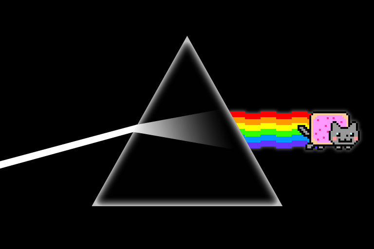

You might have noticed a fair amount of code samples presented with syntax highlighting
used in the [previous post](/gatsby-tags) on adding #hashtagging. This is achieved using
the `prismjs` library, provided as part of the `gatsby-remark-prismjs` plugin that is
shipped together with the `gatsby-starter-blog` starter.



## Marking code for syntax highlighting
Markdown uses the backtick character (`` ` ``) to denote code blocks - either surround
your inline code with single backticks (`` `hello` ``) or triple backticks for multi-line
code blocks. you should also include the code language being displayed behind the
opening triple backticks so that the highlighting library will format it appropriately.

````markdown
```javascript
const hello = (message) => console.log(`hi ${message}`)
```
````

## Themes
`prismjs` ships with a number of themes that you can use out of the box, which you can
find in `node_modules/prismjs/themes`. To change the active theme, simply change the
import statement in your `gatsby-browser.js` from `prismjs/themes/prism.css` to another
stylesheet, like `prismjs/themes/prism-tomorrow.css`. To customise this further, copy one
of the stylesheets into your project and import that file instead.

## Line numbers
To show line numbers (for multi-line code blocks), edit your `gatsby-config.js` to include
the `showLineNumbers` option.
```javascript
{
    resolve: `gatsby-remark-prismjs`,
    options: {
        showLineNumbers: true
    }
},
```
You will also need to add this import into your `gatsby-browser.js`
```javascript
import "prismjs/plugins/line-numbers/prism-line-numbers.css"
```

## Line highlighting
You might want to highlight segments within a larger code block to draw
attention to those lines. This is achieved using the special comments `// highlight-line`
within the code block itself.
````markdown
```javascript
const helloEveryone = (people) =>
    people.forEach(({ name }) => { // highlight-line // highlight-line
        console.log(`Hello ${name}`)
    })
```
````
This wraps that line in a span with the `gatsby-highlight-code-line` class, but you'll
have to implement the style yourself. This can be as simple as:
```css
.gatsby-highlight-code-line {
  display: block;
  background: olivegreen;
}
```
However, I found this lacking on longer lines of code that will scroll horizontally. Only
the initial width of the viewport is coloured and scrolling shows the later part of the
line uncoloured. i also wanted a complete line highlight without a floating left margin
and a bit of buffer on the right after the scroll ends so the code isn't touching the far
right. these are the styles i ended up with..
```css
pre[class*="language-"] > code[class*="language-"] {
  display: block;
  min-width: 100%;
  width: fit-content;
  padding-right: 0.8rem;
}
.gatsby-highlight-code-line {
  display: block;
  background: rgba(16, 92, 87, 0.7);
  padding-left: 1rem;
  margin-left: -1rem;
  width: calc(100% + 0.8rem);
}
```
## Colour coded candy containers
Code samples that are part of a longer narrative should never be an eyesore - they should
be short enough to digest while maintaining a good contrast in syntax highlighting.
`prismjs` helps you with the bulk of heavy lifting and offers a number of customisation
options, so use them as you deem fit to help your readers.. read better.
